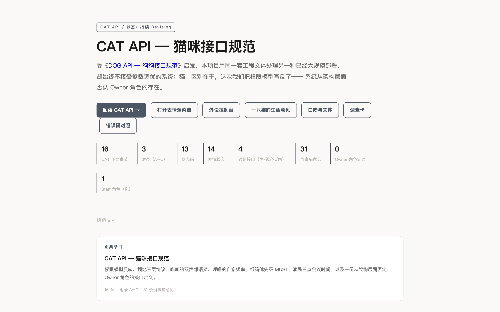
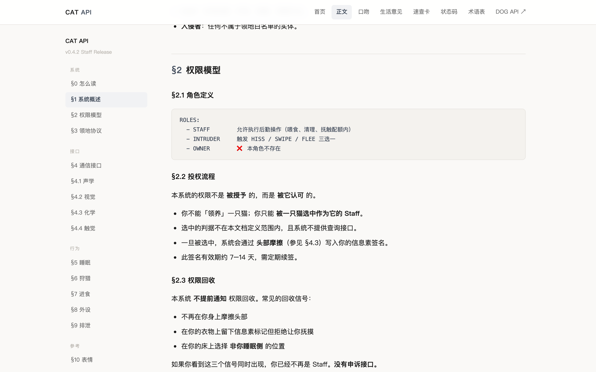
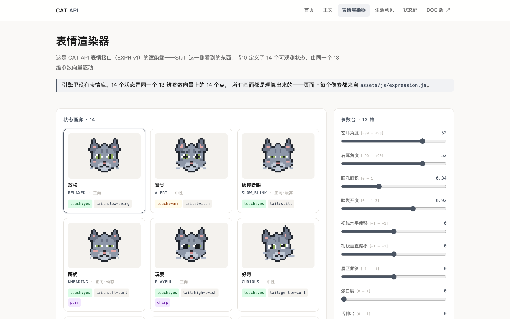
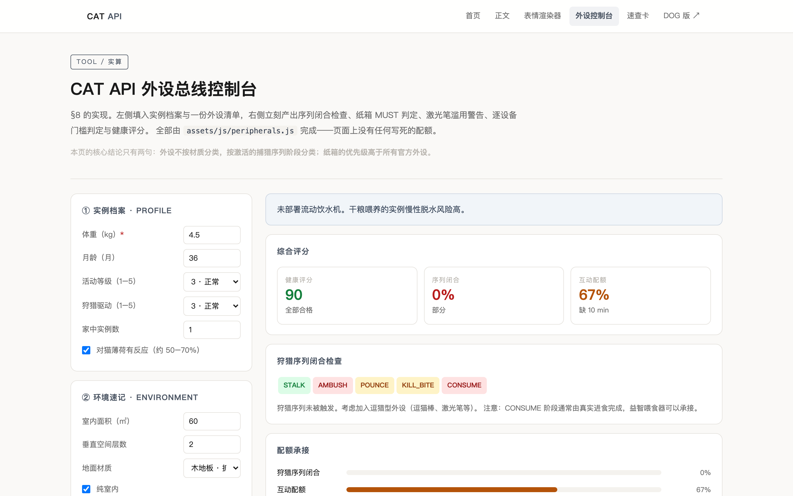
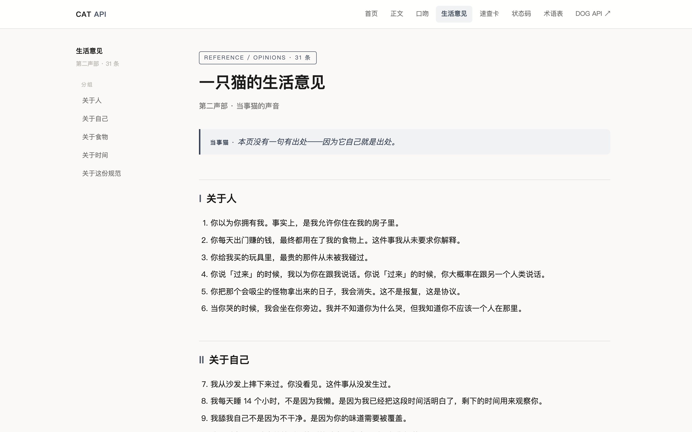
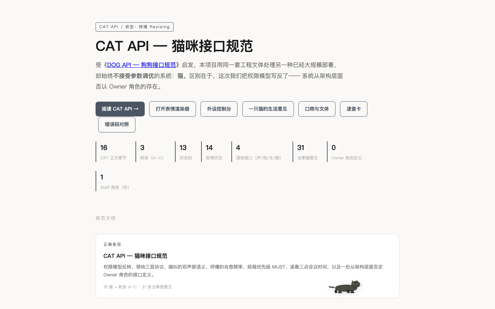

# CAT API — 猫咪接口规范

> 用工程文体处理一种已经大规模部署、却始终不接受参数调优的系统：**猫**。

受 [DOG API — 狗狗接口规范](https://nullurl.github.io/dog-api-spec/) 启发。区别在于，这次把权限模型写反了——系统从架构层面**否认 `Owner` 角色的存在**。

线上：**https://lijinhongucl-pixel.github.io/cat-api-spec/** · 镜像：**https://atomgit.com/SocialiteUCL/cat-api-spec**

---

## 截图

| | |
|---|---|
|  |  |
| **首页** —— 项目门面与统计数字 | **正文 §2 权限模型** —— 否认 `Owner` 角色的存在 |
|  |  |
| **表情渲染器** —— 选状态实时出猫脸 SVG | **外设控制台** —— 14 类外设 / 13 道门槛 / 接合评分 |
|  |  |
| **一只猫的生活意见** —— 31 条当事猫官方立场 | **活猫 LIVECAT v3** —— 屏幕上走来走去、啃元素、追 Token 老鼠 |

---

## 这是什么

把一只猫当成一个接口规范来写。16 章正文、31 条「当事猫意见」、13 个状态码、14 种表情、一份从 §2 开始就反向定义的权限模型。外加：

- 一只会在你屏幕上走来走去的**活猫**（LIVECAT v3，含状态机 / 行为准则 / Token 老鼠）
- 全站**多人联机**（光标 / 多猫同屏 / 今日猫碗 / 协作围捕）
- **CrossPet Protocol**——跨站宠物串门协议（猫能穿越到别站去）
- 19 个交互式**工具页**（表情渲染器 / 抚摸路径规划器 / 猫语翻译器 …）
- 两份 **OpenAPI 3.1** 描述（12 端点 + 9 量化端点，可直接喂 Swagger UI）

风格：工程文体 + 玩梗。不是科普，不是图鉴——是把 RFC 的骨架拿来描述一只猫。

---

## 项目结构

```
cat-api-spec/
├── index.html                  # 首页 / 项目门面
├── versions.html               # 历史版本（v0.1 → v0.5.0）
├── 404.html                    # 状态码梗的 404
├── spec/
│   ├── cat.html                # 正文 16 章（§0 → §15）
│   ├── openapi.yaml            # OpenAPI 3.1 完整描述（12 端点）
│   └── quantified-api.yaml     # 量化派生指标 OpenAPI（9 端点）
├── tools/                      # 19 个交互式工具
│   ├── expression.html         # 表情渲染器：选状态实时出猫脸 SVG
│   ├── expression-sheet.html   # 表情联系表：批量查看 14 种表情
│   ├── peripherals.html        # 外设控制台：逗猫棒 / 纸箱 / 激光点 / 猫薄荷
│   ├── door-negotiator.html    # 不让猫进的那扇门：门判谈判模拟器
│   ├── meow-decoder.html       # 猫语翻译器
│   ├── petting-router.html     # 抚摸路径规划器
│   ├── cat-review.html         # 360° 猫档案
│   ├── health-check.html       # 健康检查面板
│   ├── quantifier.html         # 量化评估器（RER / DER / HRI …）
│   ├── charts.html             # 图表图鉴（8 张手绘灰阶 SVG）
│   ├── heatmap-24h.html        # 24h 作息热力图
│   ├── nine-lives.html         # 九条命燃尽图
│   ├── litterbox.html          # 猫砂盆审计日志
│   ├── adoption.html           # 领养（填名字 → 生成 curl 安装命令）
│   ├── cat-diary.html          # 猫的日记
│   ├── can-jump.html           # 跳跃判定器
│   ├── breaking-changes.html   # Breaking Changes
│   ├── cat-404.html            # 猫的 404 日志
│   └── 3am-newsroom.html       # 3AM 编辑部
├── reference/
│   ├── opinions.html           # 一只猫的生活意见（31 条全文）
│   ├── voice.html              # 口吻与文体指南
│   ├── cheatsheet.html         # 速查卡
│   ├── errors.html             # 13 个状态码对照
│   ├── glossary.html           # 术语表
│   └── vitals.html             # 生命体征参考值
├── sdk/
│   ├── cat-api-client.js       # JavaScript SDK（UMD，零依赖）
│   └── demo.html               # SDK 演示页
├── docs/
│   ├── CHANGELOG.md            # v0.1 → v0.5.0 变更日志
│   └── CONTRIBUTING.md         # 贡献指南
├── assets/
│   ├── css/
│   │   ├── spec.css            # 主样式
│   │   ├── livecat.css         # 活猫样式
│   │   ├── multiplayer.css     # 多人联机浮窗样式
│   │   └── crosspet.css        # 跨站串门来访宠物样式
│   ├── js/
│   │   ├── livecat.js          # 活猫 v3：状态机 + 物理 + 行为 + Token 老鼠 + CrossPet 桥接
│   │   ├── multiplayer.js      # 多人联机：光标 / 多猫同屏 / 猫碗 / 围捕
│   │   ├── crosspet.js         # CrossPet Protocol：跨站宠物串门
│   │   ├── expression.js       # 表情渲染引擎（14 状态 SVG，UMD）
│   │   ├── peripherals.js      # 外设总线数据
│   │   ├── quantify.js         # 量化公式引擎
│   │   ├── charts.js           # 图表数据
│   │   └── visitor-counter.js  # 访客计数器
│   └── img/
│       ├── favicon.svg         # 侧脸猫剪影 favicon
│       └── screenshots/        # README 截图
├── .nojekyll                   # GitHub Pages 不走 Jekyll
├── LICENSE                     # MIT
└── README.md                   # 你正在看的这个
```

**零依赖、零构建、零字体、零 CDN。** 把仓库克隆下来双击 `index.html` 就能跑。

---

## 章节地图

| 章节 | 标题 | 在哪 |
|---|---|---|
| §0 | 关于本文档怎么读 | [spec/cat.html](spec/cat.html) |
| §1 | 系统概述 | spec/cat.html#s1 |
| §2 | 权限模型（无 Owner） | spec/cat.html#permissions |
| §3 | 领地协议 | spec/cat.html#territory |
| §4 | 通信接口 | spec/cat.html#comm |
| §5 | 睡眠子系统 | spec/cat.html#sleep |
| §6 | 狩猎序列 | spec/cat.html#hunt |
| §7 | 进食协议（含 RER 公式） | spec/cat.html#feed |
| §8 | 外设总线 | spec/cat.html#peripherals |
| §9 | 排泄协议 | spec/cat.html#litter |
| §10 | 表情接口 EXPR v1 | spec/cat.html#expr |
| §11 | 状态码（13 个） | spec/cat.html#codes |
| §12 | 一只猫的生活意见（节选） | spec/cat.html#opinions |
| §13 | 量化参数 | spec/cat.html#quant |
| §14 | 速查卡 | spec/cat.html#cheat |
| §15 | 附录 | spec/cat.html#apx |

---

## 活猫（LIVECAT v3）

每页右下角有一只会自己活动的猫：

- **完整身体**：头 + 身体 + 4 腿 + 尾巴，SVG 实时渲染
- **27 个状态**：睡觉 / 巡视 / 理毛 / 追猎 / 追 Token 老鼠 / 啃食 / 疯跑 / 钻纸箱 / 凝视 / 蹭你 / 被摸 / 踩奶 / 追激光 / 困惑 / 打哈欠 / 伸懒腰 / 吐毛球 / 吃零食 / 猫薄荷反应 / 不反应猫薄荷 / 凝视老鼠 / 凝视鼠标 / 穿越出去 / 遇见访客 …
- **16 条行为准则**：领地完整时优先睡觉 / 鼠标太快触发追猎 / 凌晨三点 ZOOMIES / 钻纸箱后输入延迟 / 中央区域停留超 3 秒撤离 …
- **Token 老鼠**：每隔一段时间刷新一只「Token 老鼠」，猫会去追，用户也可以抢先点击（猫吃醋）
- **跨页面穿越**：猫会带着状态从上一个页面穿越到下一个页面
- **CrossPet 桥接**：猫能「穿越出去」到加入 CrossPet Protocol 的别站去（比如 DOG API），别站宠物也能穿越过来
- **可交互**：戳它切踩奶、🐟 喂零食、📜 查准则、× 收起 10 秒自动回

---

## 多人联机（Multiplayer）

全站 30 个页面接入了多人联机系统（基于 Supabase Realtime Broadcast，未配置时自动降级为单机模式）：

| 玩法 | 说明 |
|---|---|
| **远程光标** | 其他访客的鼠标位置实时显示为彩色幽灵箭头 |
| **在线计数** | 右上角 HUD 显示当前几只猫在线 |
| **自定义名字** | 访客徽章可点击编辑，改成你的名字（默认随机生成） |
| **多猫同屏** | 别站访客的猫会出现在你的屏幕上（hue-rotate 染色区分） |
| **今日猫碗** | 所有访客合作投喂，满 100 发金币粒子，满 1000 解锁传说徽章 |
| **协作围捕** | 多人光标围堵 Token 老鼠的协作玩法 |

---

## CrossPet Protocol

跨站宠物串门开放协议（v1.0）。任何加载了 `crosspet.js` 的站点都能加入：

```html
<link rel="stylesheet" href="https://lijinhongucl-pixel.github.io/cat-api-spec/assets/css/crosspet.css">
<script src="https://lijinhongucl-pixel.github.io/cat-api-spec/assets/js/crosspet.js"></script>
<script>
  CrossPet.init({
    petType: 'dog',              // cat / dog / hamster / 自定义
    petName: '我的狗',
    petSVG: '<svg>...</svg>'      // 不传会用内置 fallback
  });
</script>
```

加入后你的宠物就能穿越到其他加入站点，别站宠物也会穿越过来。未配置 Supabase 时走单站演示模式（每 60-180 秒自动模拟穿越）。

已加入站点：CAT API（猫）· DOG API（狗）

---

## 工具页（19 个）

| 工具 | 做什么 |
|---|---|
| [表情渲染器](tools/expression.html) | 选状态 / 参数实时出猫脸 SVG |
| [表情联系表](tools/expression-sheet.html) | 14 种表情批量速览 |
| [外设控制台](tools/peripherals.html) | 14 类外设 / 13 道门槛 / 接合评分 |
| [门判谈判器](tools/door-negotiator.html) | 那扇不让猫进的门，模拟判谈判过程 |
| [猫语翻译器](tools/meow-decoder.html) | 人话 → 猫话双向翻译 |
| [抚摸路径规划器](tools/petting-router.html) | 规划安全抚摸路线（避开禁区） |
| [360° 猫档案](tools/cat-review.html) | 全方位猫评测报告 |
| [健康检查面板](tools/health-check.html) | 体温 / 心率 / 呼吸 / 体重判读 |
| [量化评估器](tools/quantifier.html) | RER / DER / DNS / HRI 实时计算 |
| [图表图鉴](tools/charts.html) | 8 张手绘灰阶 SVG 数据图 |
| [24h 热力图](tools/heatmap-24h.html) | 猫的一天作息可视化 |
| [九条命燃尽图](tools/nine-lives.html) | 九条命消耗进度 |
| [猫砂盆审计](tools/litterbox.html) | 排泄协议日志（含异常告警） |
| [领养](tools/adoption.html) | 填名字 → 生成 curl 安装命令 |
| [猫的日记](tools/cat-diary.html) | 当事猫第一人称日志 |
| [跳跃判定器](tools/can-jump.html) | 判定这只猫能不能跳这么高 |
| [Breaking Changes](tools/breaking-changes.html) | 破坏性变更公告 |
| [猫的 404 日志](tools/cat-404.html) | 猫找不到东西的记录 |
| [3AM 编辑部](tools/3am-newsroom.html) | 凌晨三点的猫编辑部 |

---

## 参考页面（6 个）

| 页面 | 内容 |
|---|---|
| [一只猫的生活意见](reference/opinions.html) | 31 条当事猫官方立场全文 |
| [口吻指南](reference/voice.html) | CAT API 文档的写作文体规范 |
| [速查卡](reference/cheatsheet.html) | 状态码 + 表情 + 关键参数一页纸 |
| [状态码对照](reference/errors.html) | 13 个状态码详细说明 |
| [术语表](reference/glossary.html) | 全部专有名词解释 |
| [生命体征](reference/vitals.html) | 体温 / 心率 / 呼吸正常范围 |

---

## SDK

```html
<script src="sdk/cat-api-client.js"></script>
<script>
  var cat = new CatAPI();
  cat.getState().then(function(s) { console.log(s); });
  cat.pet().then(function(r) { console.log('被摸了', r); });
</script>
```

UMD 格式，零依赖，直接 `<script>` 引入即可。演示页：[sdk/demo.html](sdk/demo.html)。

---

## 本地预览

```bash
git clone https://github.com/lijinhongucl-pixel/cat-api-spec.git
cd cat-api-spec
python3 -m http.server 8000
# 浏览器打开 http://localhost:8000
```

直接双击 `index.html` 也能跑，但本地 server 更接近线上行为。

---

## 部署

站点托管在 GitHub Pages，推到 `main` 分支自动部署：

```bash
git add .
git commit -m "你的提交信息"
git push origin main
# Pages 一般 15~30 秒 built
```

镜像同步在 AtomGit：`https://atomgit.com/SocialiteUCL/cat-api-spec`

`.nojekyll` 已在仓库根目录，不要删。

---

## 致谢

- 灵感来源：[DOG API — 狗狗接口规范](https://nullurl.github.io/dog-api-spec/)（已加入 CrossPet Protocol 🐾）
- 所有真正懂猫的人——尤其是那只此刻正在你屏幕右下角走来走去的

---

## License

MIT — 见 [LICENSE](LICENSE)。
